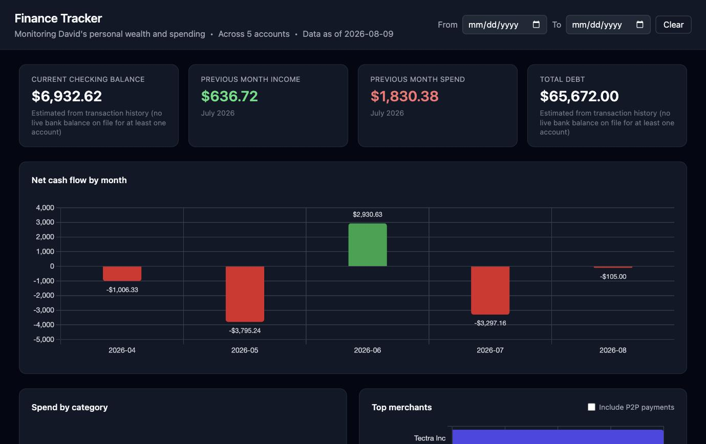
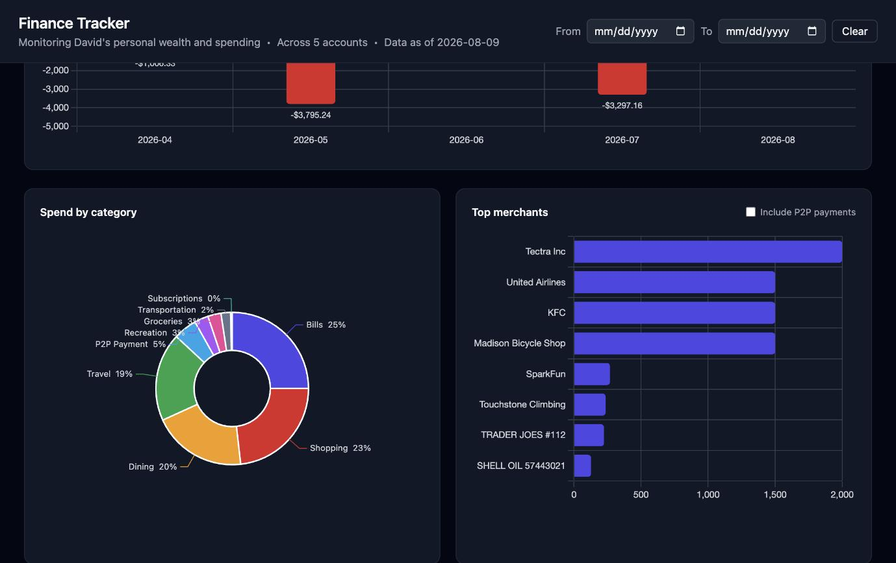
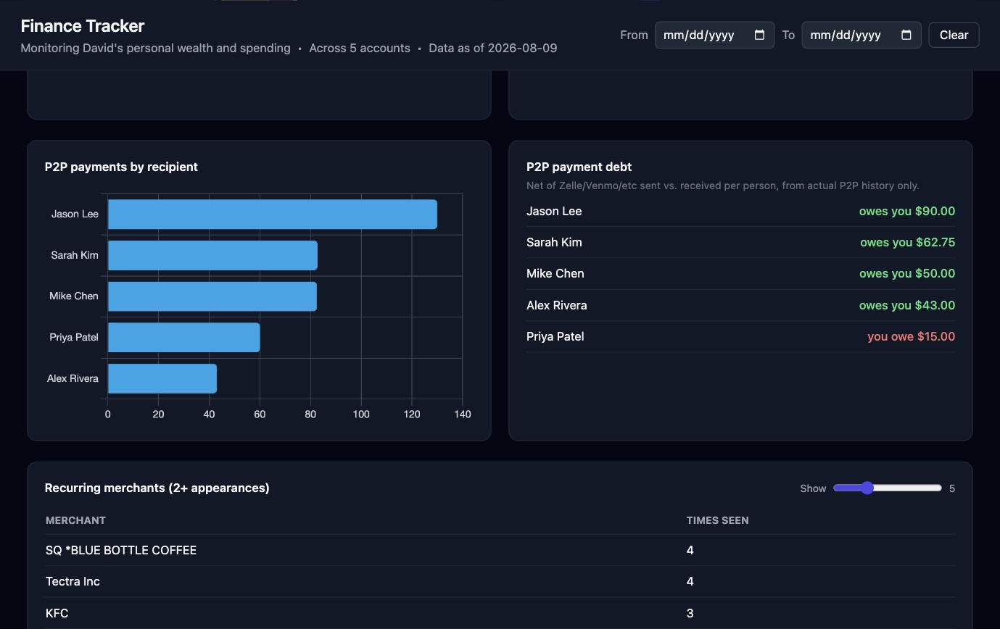
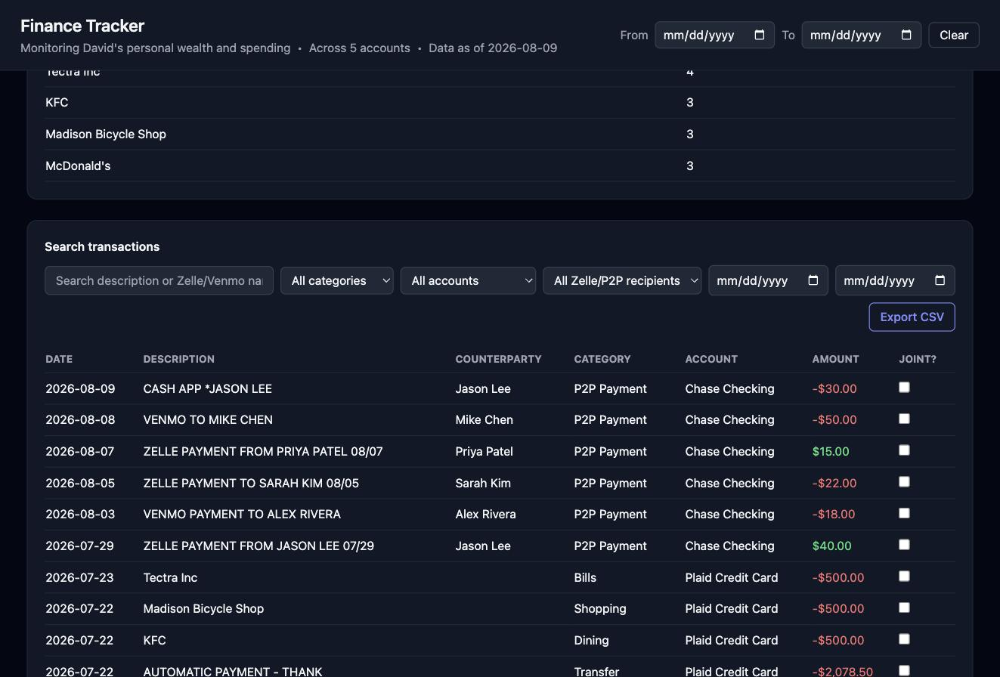

# FinanceTracker

A personal finance tracker built from scratch as a hands-on data engineering
project — ingesting transactions from both CSV exports and a real bank API
(Plaid), normalizing them through a shared pipeline, and surfacing the
result in a local dashboard.

Built while transitioning from BI/analytics into data engineering, as a way
to practice the actual engineering skills BI work doesn't usually touch:
schema design, ETL pipelines, API integration, dedup/idempotency, and basic
web app architecture.

> **Note:** the screenshots and numbers below are from **Plaid's Sandbox
> environment** plus synthetic seed data (see `data/*.csv`) — fake
> institutions, fake transactions, fake balances. This is not my real bank
> account or real finances; it's a portfolio demo of the pipeline working
> end to end. See [Getting started](#getting-started) for how to run it
> yourself against the same sandbox data.






## What it does

- Ingests transactions from **CSV exports** or **a live Plaid connection**
  (sandbox or real bank), through the exact same downstream pipeline
- Categorizes transactions with a rules engine (Dining, Groceries, Bills,
  Transfers, P2P payments, etc.)
- Extracts the counterparty on person-to-person payments (Zelle/Venmo/etc.)
  and ACH company debits, from the raw description text
- Deduplicates automatically — re-importing the same data twice is always
  a safe no-op
- Visualizes spend by category, net cash flow over time, top merchants,
  P2P payments by recipient, and recurring charges
- Tracks real account balances (via Plaid's `/accounts/get`) for a live
  checking balance and total debt, not just the transaction ledger
- Lets you manually flag a transaction as a shared/joint expense and
  computes a simple debt/surplus per Zelle/Venmo contact
- Supports full-text search across every transaction, filterable by
  category, account, counterparty, and date range

## Architecture

```
data/*.csv ─┐
            ├─→ categorize.py + counterparty.py ─→ db.py (SQLite) ─→ report.py (pandas) ─→ dashboard.py
Plaid API ──┘                                                                            (Flask + Chart.js)
```

Two independent ingestion sources (`ingest.py` for CSV, `plaid_sync.py` for
Plaid) both funnel into the same categorization, storage, and dedup logic —
the rest of the app doesn't know or care which source a transaction came
from.

| Layer | File(s) |
|---|---|
| Schema | `schema.sql` — accounts, categories, counterparties, transactions, plaid_items |
| Models | `models.py` — plain dataclasses, no ORM |
| Storage | `db.py` — connection handling, self-migrating schema, dedup via SHA-256 hash |
| Enrichment | `categorize.py`, `counterparty.py` — rules/regex, description → structured fields |
| Ingestion | `ingest.py` (CSV), `plaid_client.py` + `app.py` + `plaid_sync.py` (Plaid) |
| Analysis | `report.py` — pandas aggregations |
| Presentation | `dashboard.py` + `templates/dashboard.html` — Flask + Chart.js + Tailwind (CDN, no build step), local-only |
| Balances | `refresh_balances.py` — re-pulls current/available balance per account from Plaid |

## Tech stack

Python (stdlib `sqlite3`/`csv`/`hashlib`, `pandas`, `Flask`), SQLite,
the Plaid API, Chart.js. No ORM, no JS build step, no cloud dependency —
deliberately minimal so every layer stays inspectable.

## Getting started

Works with zero external setup using the included sample data:

```
pip install -r requirements.txt
python3 ingest.py        # loads data/sample.csv into a local finance.db
python3 dashboard.py     # open http://localhost:5001
```

Optional: connect a real (or Plaid Sandbox) bank account instead of/in
addition to CSV data — copy `.env.example` to `.env`, add your own [Plaid](https://plaid.com)
API keys, then:

```
python3 app.py           # localhost:5000 -- connect a bank via Plaid Link
python3 plaid_sync.py    # pulls transactions into the same finance.db
```

## A few engineering decisions worth calling out

- **Dedup is hash-based, not date-based.** Each transaction's fingerprint
  (`SHA256(account + date + amount + description)`) is enforced `UNIQUE` at
  the database level, so duplicate imports fail at the SQL layer itself
  rather than relying on application logic to catch them.
- **Plaid's `/transactions/sync` is cursor-based and incremental** — each
  connected bank stores a cursor, so re-syncing only pulls new activity
  instead of re-fetching full history every time.
- **Categorization is a re-runnable enrichment step, not baked into
  ingestion.** `category_id`/`counterparty_id` are nullable and recomputed
  on demand (`recategorize.py`) — fixing a bad rule doesn't require
  re-importing anything.
- **Schema evolves via a small hand-rolled migration list** in `db.py`
  (`ALTER TABLE ... ADD COLUMN`, applied idempotently on every connection) —
  a minimal version of what tools like Alembic or dbt migrations automate.
- **All user-supplied search input goes through parameterized queries**,
  never string-interpolated into SQL — the dashboard's transaction search
  takes arbitrary text input, so this matters in practice, not just in
  theory.
- **Sign conventions are normalized on the way in.** Plaid reports positive
  amounts as money leaving your account; this schema uses the opposite
  (negative = money out) to match how a plain-English bank statement
  reads, so the sign gets flipped once, at ingestion, rather than handled
  inconsistently downstream.

## What's next

- Multi-bank CSV format support (currently assumes one column layout)
- Tune the Zelle/ACH counterparty patterns against real transaction data
  (written from general knowledge, not yet validated against real examples)
- Encrypt Plaid access tokens at rest before connecting a real bank account
- Real expense-splitting for joint payments. `is_joint_payment` is currently
  just a flag you can toggle per transaction — it doesn't record *who* a
  joint charge was shared with or how much they owe, since a restaurant
  bill isn't itself a P2P transaction with a counterparty attached. The P2P
  debt numbers on the dashboard are computed only from actual Zelle/Venmo
  history (money sent vs. received per person), which is real and correct
  as far as it goes, but doesn't yet connect to non-P2P joint expenses.
- Connect a real bank account once the portfolio/demo version above is
  finished and published — this repo stays Sandbox/CSV-only until then
